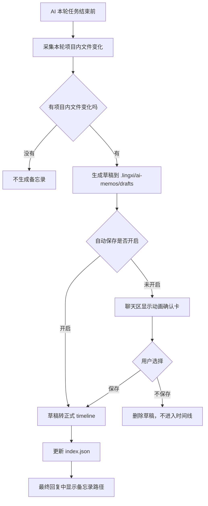

# AI 操作备忘录设计

## 目标

AI 在开发过程中不再是黑盒。每一轮发生项目内文件改动的 AI 操作，都可以形成一份项目隔离的开发备忘录，说明本轮改了什么、创建了什么、删除了什么、增加了什么功能、验证了什么、有哪些疑似残留风险。

备忘录必须跟随项目保存，不进入软件全局数据目录。用户未开启自动保存时，备忘录先作为草稿生成，再复用“多 AI 协作完成后询问是否发给主 AI 分析”的动画确认逻辑，由用户选择保存或删除。

## 设计原则

- 项目隔离：备忘录存放在当前项目根目录下，不存软件数据目录。
- 事实优先：文件变化、增删改、diff 统计、快照信息由程序采集；AI 只补充人类可读解释。
- 默认不打扰项目历史：默认不自动保存，每次询问用户是否保存。
- 不弹窗：复用多 AI 协作完成后的动画确认卡，不使用系统弹窗。
- 只采集项目内路径：用户让 AI 操作项目外文件时，不进入项目备忘录文件清单。
- 模块化：新增独立后端模块、前端模块和样式文件，避免继续堆进大文件。
- 可联动：后续和 AI 安全快照中心的本地分支主线时间线联动。

## 存储结构

存储位置固定在项目根目录：

```text
项目根目录/.lingxi/ai-memos/
  drafts/
    memo-20260701-143012-session-id.md
  timeline/
    memo-20260701-143012-session-id.md
  index.json
```

说明：

- `drafts/`：待用户确认的草稿，不进入正式项目发展史。
- `timeline/`：用户确认保存或自动保存后的正式备忘录。
- `index.json`：时间线索引，供安全快照中心和备忘录列表快速读取。

软件全局配置中只保存偏好，例如：

```json
{
  "autoSaveAiOperationMemo": false
}
```

备忘录正文、草稿、索引都不写入软件数据目录。

## 路径边界

只采集当前项目根目录内的文件变化。路径判断必须使用规范化路径，不允许用字符串包含判断。

规则：

- 项目内源码、资源、配置文件：采集。
- 项目根目录外文件：不采集。
- 项目内 `.lingxi/ai-memos/**`：不作为业务文件变化采集。
- 项目内 `.git/**`、`node_modules/**`、`dist/**`、临时缓存目录：默认不采集。
- 符号链接：尽量用 `realpath` 解析后再判断，无法解析时退回 `resolve` 判断。

建议工具函数：

```js
function isInsideProjectPath(projectPath, targetPath) {
  const projectRoot = path.resolve(projectPath)
  const target = path.resolve(targetPath)
  const relative = path.relative(projectRoot, target)
  return !!relative && !relative.startsWith('..') && !path.isAbsolute(relative)
}
```

项目外操作不写入文件清单，只可在备忘录中保留非敏感提示：

```md
## 项目外操作提示

本轮检测到项目外路径操作，未纳入当前项目发展史。
```

不记录项目外真实路径，避免泄露隐私或污染项目记录。

## 后端模块

新增目录：

```text
electron/modules/ai-operation-memos/
  index.js
  paths.js
  collector.js
  markdown.js
  store.js
  settings.js
  ipc.js
```

模块职责：

| 模块 | 职责 |
| --- | --- |
| `index.js` | 对外入口，组合创建草稿、保存草稿、删除草稿、读取时间线 |
| `paths.js` | 只负责项目根目录下 `.lingxi/ai-memos` 路径、安全路径判断、目录创建 |
| `collector.js` | 收集本轮事实：文件变化、工具结果、diff stat、测试命令、快照信息 |
| `markdown.js` | 根据结构化事实生成 Markdown |
| `store.js` | 负责 `drafts/`、`timeline/`、`index.json` 的读写和迁移 |
| `settings.js` | 读取/保存自动保存偏好，偏好仍放软件设置 |
| `ipc.js` | 注册前后端 IPC，不塞进已有大文件 |

已有文件只做薄接入：

- `electron/modules/ai-chat.js`：最终回复前调用 `aiOperationMemos.createDraftForRun(...)`，不写业务细节。
- `electron/preload.js`：暴露少量 IPC。
- `electron/modules/ipc.js`：注册 `ai-operation-memos/ipc.js`。

## 前端模块

新增文件：

```text
frontend/scripts/features/ai-operation-memo-ui.js
frontend/scripts/features/ai-operation-memo-settings.js
frontend/styles/ai-operation-memo.css
```

模块职责：

| 模块 | 职责 |
| --- | --- |
| `ai-operation-memo-ui.js` | 显示备忘录确认动画卡、处理保存/不保存、展示路径和状态 |
| `ai-operation-memo-settings.js` | 设置页中的自动保存开关绑定 |
| `ai-operation-memo.css` | 备忘录确认卡和时间线按钮样式 |

已有文件只做薄接入：

- `agent-collaboration-ui.js`：抽出或暴露通用 handoff 动画渲染器，不塞备忘录逻辑。
- `settings-main.js` / `storage-settings.js`：只挂设置入口和开关绑定。
- `git-panel.js`：后续只读取 memo index 并渲染入口，不负责备忘录业务。

## 交互流程



确认卡复用多 AI 协作完成后的动画视觉：

```text
本次 AI 操作已生成开发备忘录，是否保存到项目发展史？

[保存] [不保存]
```

保存后：

```text
已保存到项目发展史
E:\项目\.lingxi\ai-memos\timeline\memo-xxxx.md
```

不保存后：

```text
已删除本次备忘录草稿
```

## 备忘录数据结构

`index.json` 示例：

```json
{
  "version": 1,
  "projectPath": "E:\\project",
  "items": [
    {
      "id": "memo-20260701-143012-a1b2",
      "title": "设置页 UI 重塑",
      "createdAt": "2026-07-01T14:30:12.000+08:00",
      "status": "saved",
      "filePath": ".lingxi/ai-memos/timeline/memo-20260701-143012-a1b2.md",
      "summary": "重塑模型设置、生态导航、AI 授权和存储路径设置界面。",
      "stats": {
        "modified": 4,
        "created": 0,
        "deleted": 0,
        "outsideProjectOps": 0
      },
      "files": [
        {
          "path": "frontend/styles/settings.css",
          "status": "modified",
          "additions": 575,
          "deletions": 33
        }
      ],
      "snapshot": {
        "id": "",
        "branch": "main"
      }
    }
  ]
}
```

## Markdown 模板

```md
# AI 操作备忘录

## 任务目标

- 用户要求：...

## 本次改动摘要

- ...

## 文件变化

| 状态 | 文件 | + | - | 说明 |
| --- | --- | ---: | ---: | --- |
| 修改 | frontend/styles/settings.css | 575 | 33 | 重塑设置页控制台布局 |

## 新增功能

- ...

## 修改功能

- ...

## 删除或清理

- ...

## 潜在残留风险

- 未发现明显残留风险。

## 验证记录

- `node --check ...` 通过
- `git diff --check` 通过

## 项目外操作提示

本轮未记录项目外文件操作。

## 关联信息

- 项目路径：...
- 分支：...
- 安全快照：...
- 会话：...
```

## 事实采集来源

采集器优先使用结构化事实：

- 工具调用事件：文件编辑、写入、删除、移动、命令执行、测试命令。
- Git / diff：项目内文件的状态、增删行统计。
- 安全快照：恢复点或 git 快照 id。
- 当前项目信息：项目 id、项目路径、当前分支、会话 id。
- 最终回复摘要：AI 的简短说明，作为备注，不作为事实来源。

如果 Git 不可用，降级为工具事件和文件快照记录；如果工具事件不足，备忘录应明确标记“采集不完整”，不能假装完整。

## 设置项

设置界面增加：

```text
AI 操作备忘录
[ ] 自动保存每次 AI 操作备忘录
```

默认关闭。

说明文案：

```text
关闭时，每次 AI 修改项目文件后会在聊天区询问是否保存备忘录。
开启后，备忘录会自动保存到当前项目的 .lingxi/ai-memos/timeline。
```

可后续增加：

```text
[x] 只在项目内文件发生变化时生成
[x] 最终回复中显示备忘录路径
```

## 安全快照中心联动

第一阶段只保存备忘录和索引。第二阶段在 AI 安全快照中心本地分支主线时间线读取 `index.json`。

主线时间线展示：

```text
14:30 设置页 UI 重塑
修改 4 · 新增 0 · 删除 0
备忘录  Diff  恢复
```

联动规则：

- 时间线只展示当前项目 `.lingxi/ai-memos/timeline` 内正式备忘录。
- 草稿不展示。
- 项目外文件不展示。
- 点击“备忘录”打开 Markdown。
- 点击“Diff”沿用当前改动查看能力。
- 恢复仍走安全快照现有逻辑。

## 异常处理

- 项目路径为空：不生成备忘录。
- 项目路径不可写：提示失败，不回退到软件数据目录。
- AI 最终回复失败：保留草稿，标记 `interrupted`，下次启动可提示保存或删除。
- 用户切换项目：确认卡带 projectId，只在对应项目活动时显示；切回项目后可继续处理。
- 自动保存开启但写入失败：最终回复中提示备忘录保存失败。
- 用户点击不保存：删除 drafts 文件，不更新 `index.json`。

## 实施阶段

### 阶段 1：MVP

- 新增后端模块目录和 IPC。
- 生成项目路径下草稿。
- 只采集项目内路径变化。
- 设置自动保存开关，默认关闭。
- 复用协作 handoff 动画显示保存/不保存。
- 保存转入 `timeline/`，删除移除草稿。

### 阶段 2：时间线联动

- AI 安全快照中心读取 `index.json`。
- 主线时间线展示备忘录摘要。
- 支持点击打开备忘录。

### 阶段 3：质量增强

- 残留风险扫描。
- 草稿恢复处理。
- 与恢复点 / git commit 更精确关联。
- 对大文件、二进制、生成物做更清晰的过滤和提示。

## 不做的事

- 不记录项目外具体文件路径。
- 不把备忘录正文写入软件数据目录。
- 不把全部逻辑堆进 `ai-chat.js`、`git-panel.js`、`agent-collaboration-ui.js`。
- 不让 AI 凭空编造文件变化。
- 不用系统弹窗打断用户。
